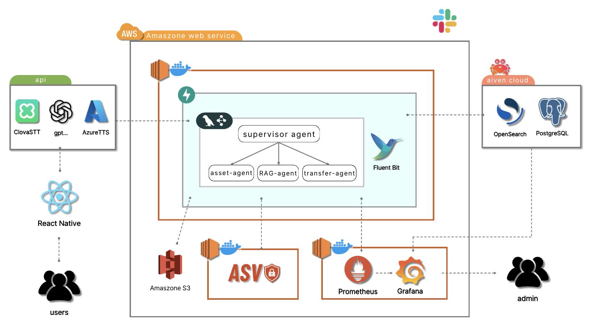

# [우리FISA 6기] AI 엔지니어링 과정 2팀

## 1. 프로젝트 개요
 - 주제 : 시각장애인을 위한 음성 AI 멀티 에이전트 기반 뱅킹 앱
 - 프로젝트 기획 배경 : 시각장애인은 기존 모바일 뱅킹 앱의 복잡한 화면 구성, 작은 버튼, 보안매체 사용 등으로 인해 송금이나 계좌 조회 같은 기본적인 금융 거래조차 큰 불편을 겪는다. 스크린리더만으로는 여러 단계로 이어지는 이체 흐름을 온전히 따라가기 어렵고, 특히 본인인증 단계에서는 타인의 도움이 필요한 경우가 잦아 금융 자립성과 보안이 동시에 제약된다. 본 프로젝트는 이러한 문제를 해결하기 위해, 음성만으로 뱅킹 앱의 핵심 기능을 수행할 수 있는 배리어프리 뱅킹 서비스를 구축하였다.
 - 기술 스택

   <p><strong>앱 · AI · 백엔드</strong><br>
   
   
   
   
   </p>

   <p><strong>인프라 · 운영</strong><br>
   
   <img src="https://img.shields.io/badge/AWS-FF9900?style=for-the-badge&logo=data:image/svg+xml;base64,PHN2ZyByb2xlPSJpbWciIHZpZXdCb3g9IjAgMCAyNCAyNCIgeG1sbnM9Imh0dHA6Ly93d3cudzMub3JnLzIwMDAvc3ZnIiBmaWxsPSJ3aGl0ZSI+PHBhdGggZD0iTTYuNzYzIDEwLjAzNmMwIC4yOTYuMDMyLjUzNS4wODguNzEuMDY0LjE3Ni4xNDQuMzY4LjI1Ni41NzYuMDQuMDYzLjA1Ni4xMjcuMDU2LjE4MyAwIC4wOC0uMDQ4LjE2LS4xNTIuMjRsLS41MDMuMzM1YS4zODMuMzgzIDAgMCAxLS4yMDguMDcyYy0uMDggMC0uMTYtLjA0LS4yMzktLjExMmEyLjQ3IDIuNDcgMCAwIDEtLjI4Ny0uMzc1IDYuMTggNi4xOCAwIDAgMS0uMjQ4LS40NzFjLS42MjIuNzM0LTEuNDA1IDEuMTAxLTIuMzQ3IDEuMTAxLS42NyAwLTEuMjA1LS4xOTEtMS41OTYtLjU3NC0uMzkxLS4zODQtLjU5LS44OTQtLjU5LTEuNTMzIDAtLjY3OC4yMzktMS4yMy43MjYtMS42NDQuNDg3LS40MTUgMS4xMzMtLjYyMyAxLjk1NS0uNjIzLjI3MiAwIC41NTEuMDI0Ljg0Ni4wNjQuMjk2LjA0LjYuMTA0LjkxOC4xNzZ2LS41ODNjMC0uNjA3LS4xMjctMS4wMy0uMzc1LTEuMjc3LS4yNTUtLjI0OC0uNjg2LS4zNjctMS4zLS4zNjctLjI4IDAtLjU2OC4wMzEtLjg2My4xMDMtLjI5NS4wNzItLjU4My4xNi0uODYyLjI3MmEyLjI4NyAyLjI4NyAwIDAgMS0uMjguMTA0LjQ4OC40ODggMCAwIDEtLjEyNy4wMjNjLS4xMTIgMC0uMTY4LS4wOC0uMTY4LS4yNDd2LS4zOTFjMC0uMTI4LjAxNi0uMjI0LjA1Ni0uMjhhLjU5Ny41OTcgMCAwIDEgLjIyNC0uMTY3Yy4yNzktLjE0NC42MTQtLjI2NCAxLjAwNS0uMzZhNC44NCA0Ljg0IDAgMCAxIDEuMjQ2LS4xNTFjLjk1IDAgMS42NDQuMjE2IDIuMDkxLjY0Ny40MzkuNDMuNjYyIDEuMDg1LjY2MiAxLjk2M3YyLjU4NnptLTMuMjQgMS4yMTRjLjI2MyAwIC41MzQtLjA0OC44MjItLjE0NC4yODctLjA5Ni41NDMtLjI3MS43NTgtLjUxLjEyOC0uMTUyLjIyNC0uMzIuMjcyLS41MTIuMDQ3LS4xOTEuMDgtLjQyMy4wOC0uNjk0di0uMzM1YTYuNjYgNi42NiAwIDAgMC0uNzM1LS4xMzYgNi4wMiA2LjAyIDAgMCAwLS43NS0uMDQ4Yy0uNTM1IDAtLjkyNi4xMDQtMS4xOS4zMi0uMjYzLjIxNS0uMzkuNTE4LS4zOS45MTcgMCAuMzc1LjA5NS42NTUuMjk1Ljg0Ni4xOTEuMi40Ny4yOTYuODM4LjI5NnptNi40MS44NjJjLS4xNDQgMC0uMjQtLjAyNC0uMzA0LS4wOC0uMDY0LS4wNDgtLjEyLS4xNi0uMTY4LS4zMTFMNy41ODYgNS41NWExLjM5OCAxLjM5OCAwIDAgMS0uMDcyLS4zMmMwLS4xMjguMDY0LS4yLjE5MS0uMmguNzgzYy4xNTEgMCAuMjU1LjAyNS4zMS4wOC4wNjUuMDQ4LjExMy4xNi4xNi4zMTJsMS4zNDIgNS4yODQgMS4yNDUtNS4yODRjLjA0LS4xNi4wODgtLjI2NC4xNTEtLjMxMmEuNTQ5LjU0OSAwIDAgMSAuMzItLjA4aC42MzhjLjE1MiAwIC4yNTYuMDI1LjMyLjA4LjA2My4wNDguMTIuMTYuMTUxLjMxMmwxLjI2MSA1LjM0OCAxLjM4MS01LjM0OGMuMDQ4LS4xNi4xMDQtLjI2NC4xNi0uMzEyYS41Mi41MiAwIDAgMSAuMzExLS4wOGguNzQzYy4xMjcgMCAuMi4wNjUuMi4yIDAgLjA0LS4wMDkuMDgtLjAxNy4xMjhhMS4xMzcgMS4xMzcgMCAwIDEtLjA1Ni4ybC0xLjkyMyA2LjE3Yy0uMDQ4LjE2LS4xMDQuMjYzLS4xNjguMzExYS41MS41MSAwIDAgMS0uMzAzLjA4aC0uNjg3Yy0uMTUxIDAtLjI1NS0uMDI0LS4zMi0uMDgtLjA2My0uMDU2LS4xMTktLjE2LS4xNS0uMzJsLTEuMjM4LTUuMTQ4LTEuMjMgNS4xNGMtLjA0LjE2LS4wODcuMjY0LS4xNS4zMi0uMDY1LjA1Ni0uMTc3LjA4LS4zMi4wOHptMTAuMjU2LjIxNWMtLjQxNSAwLS44My0uMDQ4LTEuMjI5LS4xNDMtLjM5OS0uMDk2LS43MS0uMi0uOTE4LS4zMi0uMTI4LS4wNzEtLjIxNS0uMTUxLS4yNDctLjIyM2EuNTYzLjU2MyAwIDAgMS0uMDQ4LS4yMjR2LS40MDdjMC0uMTY3LjA2NC0uMjQ3LjE4My0uMjQ3LjA0OCAwIC4wOTYuMDA4LjE0NC4wMjQuMDQ4LjAxNi4xMi4wNDguMi4wOC4yNzEuMTIuNTY2LjIxNS44NzguMjc5LjMxOS4wNjQuNjMuMDk2Ljk1LjA5Ni41MDIgMCAuODk0LS4wODggMS4xNjUtLjI2NGEuODYuODYgMCAwIDAgLjQxNS0uNzU4Ljc3Ny43NzcgMCAwIDAtLjIxNS0uNTU5Yy0uMTQ0LS4xNTEtLjQxNi0uMjg3LS44MDctLjQxNWwtMS4xNTctLjM2Yy0uNTgzLS4xODMtMS4wMTQtLjQ1NC0xLjI3Ny0uODEzYTEuOTAyIDEuOTAyIDAgMCAxLS40LTEuMTU4YzAtLjMzNS4wNzMtLjYzLjIxNi0uODg2LjE0NC0uMjU1LjMzNS0uNDc5LjU3NS0uNjU0LjI0LS4xODQuNTEtLjMyLjgxNC0uNDE1LjMwNC0uMDk2LjYyMy0uMTQ0Ljk1MC0uMTQ0LjE2OCAwIC4zMzUuMDA4LjQ5NS4wMzIuMTY4LjAyNC4zMi4wNTYuNDcuMDg4LjE0NC4wNC4yNzkuMDguNDA3LjEyOC4xMjguMDQ4LjIyNC4wOTYuMjk1LjE0NGEuNTc2LjU3NiAwIDAgMSAuMjE1LjE4My40My40MyAwIDAgMSAuMDcyLjI2NHYuMzc1YzAgLjE2OC0uMDY0LjI1Ni0uMTg0LjI1NmEuODMuODMgMCAwIDEtLjMwMy0uMDk2IDMuNjUyIDMuNjUyIDAgMCAwLTEuNTMyLS4zMTFjLS40NTUgMC0uODE1LjA3MS0xLjA2Mi4yMjMtLjI0OC4xNTItLjM3NS4zODMtLjM3NS43MSAwIC4yMjQuMDguNDE2LjI0LjU2Ny4xNTkuMTUyLjQ1NC4zMDQuODc3LjQ0bDEuMTM0LjM1OGMuNTc0LjE4NC45OTAuNDQgMS4yMzcuNzY3LjI0Ny4zMjcuMzY3LjcwMi4zNjcgMS4xMTcgMCAuMzQzLS4wNzIuNjU1LS4yMDcuOTI2LS4xNDQuMjcyLS4zMzYuNTExLS41ODMuNzAzLS4yNDguMi0uNTQzLjM0My0uODg2LjQ0Ny0uMzYuMTExLS43NDMuMTY3LTEuMTU1LjE2N3pNMjAuMTYgMTcuNzQ5Yy0yLjE2MyAxLjYtNS4zMDYgMi40NS04LjAxNiAyLjQ1LTMuNzkgMC03LjIwOC0xLjQtOS43OS0zLjcyNi0uMi0uMTg0LS4wMjQtLjQzMS4yMjQtLjI4OCAyLjc4OSAxLjYyNCA2LjIzNiAyLjYwMyA5Ljc5NCAyLjYwMyAyLjQgMCA1LjAzNS0uNDk3IDcuNDYtMS41MjguMzY3LS4xNTkuNjcuMjQuMzI4LjQ4OXpNMjEuMDY5IDE2LjcxYy0uMjc5LS4zNTktMS44NDUtLjE2Ny0yLjU0OS0uMDg3LS4yMTQuMDI0LS4yNDctLjE2LS4wNTYtLjI5NiAxLjI0NS0uODc3IDMuMjkzLS42MjMgMy41MzEtLjMzLjIzOS4zMDItLjA2NCAyLjM1LTEuMjM3IDMuMzMxLS4xOC4xNTEtLjM1Mi4wNzItLjI3MS0uMTI3LjI2NS0uNjYzLjg1NC0yLjE1LjU4Mi0yLjQ5MXoiLz48L3N2Zz4K&logoColor=white" alt="AWS">
   
   </p>

   <p><strong>기획 · 디자인</strong><br>
   </p>


## 2. 아키텍처

### 2.1 시스템 아키텍처

**설명**

**CI/CD 및 배포**  
GitHub Actions 기반 CI/CD 파이프라인을 통해 코드 변경 시 자동으로 빌드 및 배포가 이루어집니다. Backend(FastAPI)는 Docker 컨테이너로 AWS에 배포됩니다.

**데이터 및 보안**  
PostgreSQL, S3, OpenSearch와 연동하여 금융 데이터 저장 및 검색 기능을 수행합니다. 송금 등 민감 거래 시에는 ASV(화자인증)를 통해 본인 확인을 수행합니다.

**모니터링 및 운영**  
Prometheus, Grafana, Fluent Bit, Slack을 활용한 모니터링 및 로그 관리 환경을 통해 시스템의 안정적인 운영을 지원합니다.


## 3. 주요 기능 소개
### 3.1 핵심 기술 구성


### 3.2 AI 에이전트 워크플로우


**설명**

**음성 AI 파이프라인**  
Clova STT·GPT·Azure TTS와 연동하여 음성 입력, AI 처리, 음성 응답까지의 흐름을 구성합니다. LangGraph Supervisor가 transfer·asset·RAG 하위 에이전트로 업무를 분기하는 멀티 에이전트 구조를 적용하였습니다.
### 3.3 통합 워크플로우 다이어그램


### 3.4 모니터링

<table width="100%"><tr>
<td align="center" width="50%"><br><sub>음성 파이프라인 현황</sub></td>
<td align="center" width="50%"><br><sub>에러 분석</sub></td>
</tr></table>

<p align="center">
  <br>
  <sub>ASV 화자인증 현황</sub>
</p>

### 3.5 세부 기능 소개


---

#### [기능 1] AES-256-GCM 컬럼 단위 암호화

- **파일:** `backend/app/shared/crypto.py`
- **설명:** 주민번호·계좌번호를 DB에 저장할 때 컬럼 단위로 암호화. nonce를 매번 새로 생성해 동일 평문도 다른 암호문이 나오는 비결정적 암호화 설계. 복호화는 반드시 이 모듈의 `decrypt()`를 통해서만 수행하도록 단일 책임 원칙 적용

**핵심 코드**

```python
def encrypt(plaintext: str | None) -> str | None:
    aesgcm = AESGCM(_key())
    nonce = os.urandom(_NONCE_BYTES)          # 12바이트 랜덤 nonce (매번 새로 생성)
    ciphertext = aesgcm.encrypt(nonce, plaintext.encode(), None)
    return base64.urlsafe_b64encode(nonce + ciphertext).decode()
    # 출력: base64url(nonce_12B + ciphertext + auth_tag_16B)
```

---

#### [기능 2] LangGraph Supervisor 우선순위 기반 도메인 라우팅

- **파일:** `backend/app/shared/agent/supervisor.py`
- **설명:** 단순 LLM 분류가 아니라 키워드 패스트패스 → 세션 유지 → 도메인 전환 감지 → LLM 폴백 순의 6단계 우선순위 체계로 응답 속도와 정확도를 동시에 확보. gpt-4o-nano는 최후 수단으로만 호출

**핵심 코드**

```python
async def _decide_domain(text: str, state: VoiceState) -> str:
    if _is_navigation_utterance(text):
        return "cancel"                              # 1순위: 홈 이동 키워드 (세션 무관)
    if _is_cancel_utterance(text) and _has_active_session(state):
        return "cancel"                              # 2순위: 취소 + 활성 세션
    if _has_active_session(state):
        return "transfer"                            # 3순위: 이체 세션 유지
    if state.get("agent_domain") == "asset" and not _is_domain_switch_utterance(text):
        return "asset"                               # 4순위: asset 연속 세션 유지
    if is_plain_transfer_start(text):
        return "transfer"                            # 5순위: 이체 키워드 패스트패스
    if "이벤트" in _normalize(text):
        return "event"                               # 5순위: 이벤트 키워드
    return await _llm_classify_domain(text)          # 6순위: gpt-4o-mini LLM 폴백
```

---

#### [기능 3] CAM++ ASV 화자 인증 (192차원 임베딩 + 코사인 유사도)

- **파일:** `ai/asv/model.py`
- **설명:** 이체 실행 전 본인 목소리를 실시간 검증. 오디오를 16kHz 모노로 정규화 후 CAM++ 모델로 192차원 임베딩 추출. 코사인 유사도가 환경변수 `ASV_THRESHOLD` 이상이면 동일 화자로 판정. 어떤 상태도 영속하지 않는 Stateless 설계

**핵심 코드**

```python
def extract_embedding(self, audio_bytes: bytes) -> list[float]:
    # soundfile 디코딩 → 스테레오→모노 → 16kHz 리샘플링 → 임시 파일 기록
    result = self._pipeline([tmp_path], output_emb=True)
    return np.array(result["embs"]).flatten().tolist()  # 192차원 벡터 반환

@staticmethod
def cosine_similarity(embedding1: list[float], embedding2: list[float]) -> float:
    a = np.array(embedding1, dtype=np.float32)
    b = np.array(embedding2, dtype=np.float32)
    if np.linalg.norm(a) == 0.0 or np.linalg.norm(b) == 0.0:
        return 0.0
    return float(np.dot(a, b) / (np.linalg.norm(a) * np.linalg.norm(b)))
    # >= ASV_THRESHOLD → is_same_speaker=True
```

---

#### [기능 4] STT 오디오 입력 검증 파이프라인

- **파일:** `backend/app/shared/voice/stt_service.py`
- **설명:** Clova Speech API 호출 전에 파일 크기(10MB), 포맷(10종 MIME), 길이(60초)를 3단 검증해 불필요한 외부 API 비용 차단. 길이 검증은 mutagen으로 실제 오디오 메타데이터를 파싱해 수행

**핵심 코드**

```python
def _validate_audio(audio_bytes: bytes, content_type: str) -> None:
    if len(audio_bytes) > MAX_AUDIO_BYTES:                    # 10 MB 초과
        raise STTError(code="VOICE_AUDIO_TOO_LARGE", ...)
    mime = content_type.split(";")[0].strip().lower()
    if mime not in SUPPORTED_CONTENT_TYPES:                   # 포맷 미지원
        raise STTError(code="VOICE_AUDIO_INVALID_FORMAT", ...)
    duration = _get_audio_duration(audio_bytes)               # mutagen 메타데이터 파싱
    if duration is not None and duration > MAX_AUDIO_DURATION:# 60초 초과
        raise STTError(code="VOICE_AUDIO_TOO_LONG", ...)
```

---

#### [기능 5] Azure TTS SSML 속도 제어

- **파일:** `backend/app/shared/voice/tts_service.py`
- **설명:** 시각장애인 대상 앱이므로 TTS 속도 조절이 핵심 UX. float 속도값을 SSML prosody rate 포맷(+50%, -20%)으로 변환해 Azure TTS에 전달. 속도 범위 0.25~4.0 검증 포함

**핵심 코드**

```python
def _build_ssml(text: str, voice_name: str, speed: float) -> str:
    rate = _speed_to_rate(speed)   # 1.5 → "+50%", 0.8 → "-20%"
    return (
        "<speak version='1.0' xml:lang='ko-KR'>"
        f"<voice name='{voice_name}'>"
        f"<prosody rate='{rate}'>{text}</prosody>"
        "</voice></speak>"
    )

def _speed_to_rate(speed: float) -> str:
    percentage = round((speed - 1.0) * 100)
    return f"+{percentage}%" if percentage >= 0 else f"{percentage}%"
```

---

#### [기능 6] 이체 멱등성 3중 보호

- **파일:** `backend/app/features/transfer/service.py`
- **설명:** 네트워크 재시도·앱 재실행 등으로 동일 이체가 중복 실행되는 것을 3단계로 차단. 앱 레벨 키 중복 조회 → DB UNIQUE 제약으로 동시 INSERT 차단 → SELECT FOR UPDATE 비관적 락으로 잔액 이중 차감 방지. 이미 완료된 요청은 DB 조회 없이 기존 영수증을 재반환

**핵심 코드**

```python
# 1단계: 앱 레벨 — 키 중복 조회
existing = db.query(Transaction).filter(
    Transaction.idempotency_key == idempotency_key
).first()
if existing and existing.status == "completed":
    return _build_receipt(existing)   # 출금 없이 기존 영수증 재반환

# 2단계: DB 레벨 — pending INSERT 후 UNIQUE 위반 즉시 감지 (동시 요청 최후 방어선)
tx = Transaction(..., status="pending", idempotency_key=idempotency_key)
db.add(tx)
db.flush()   # IntegrityError → 409 반환

# 3단계: 비관적 락 — 잔액 이중 차감 방지
locked = db.query(Account).filter(
    Account.account_id == from_account.account_id
).with_for_update().first()
locked.balance -= amount
tx.status = "completed"
db.commit()
```

---

#### [기능 7] VoiceState 멀티턴 슬롯 수집 상태 머신

- **파일:** `backend/app/shared/agent/state.py`
- **설명:** 음성 이체는 수취인·금액·주기 등 여러 정보를 여러 턴에 걸쳐 수집해야 한다. LangGraph MemorySaver에 thread_id=user_id로 상태를 영속해, 새 턴마다 대화 이력만 추가하면 나머지 슬롯·확인 상태가 자동으로 이어짐. ASV 검증 단계도 동일한 상태 객체로 제어

**핵심 코드**

```python
class VoiceState(TypedDict):
    messages: Annotated[list, add_messages]   # 대화 이력 자동 누적 (add_messages 리듀서)
    pending_action: str | None                # "transfer" | "auto_transfer"
    collected_slots: dict                     # {"recipient": "엄마", "amount": 100000}
    awaiting_confirmation: bool               # "네/아니오" 확인 대기
    awaiting_asv_audio: bool                  # 다음 오디오 → ASV EC2 서버 라우팅
    asv_retry_count: int                      # 실패 3회 초과 시 pending_action 취소
    execution_ready: bool                     # 확인 완료 → execute_node 즉시 실행
    last_tx_id: str | None                    # 이체 직후 메모 제안용 tx_id 보관
    awaiting_memo_decision: bool              # 이체 후 메모 제안 응답 대기
```

