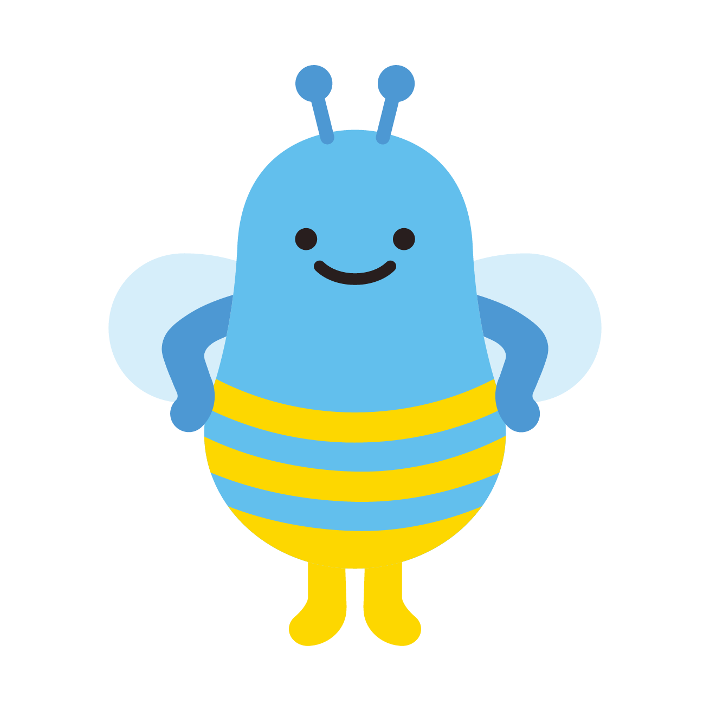
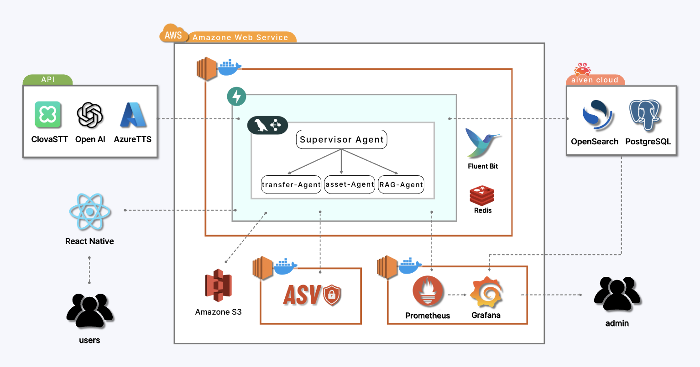
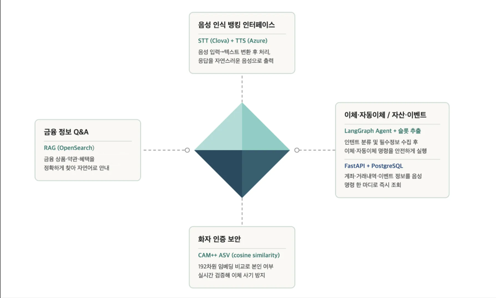
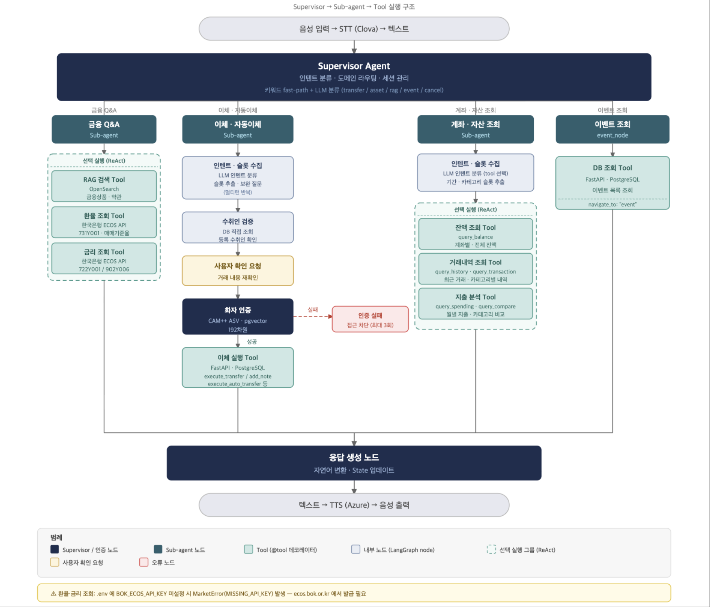
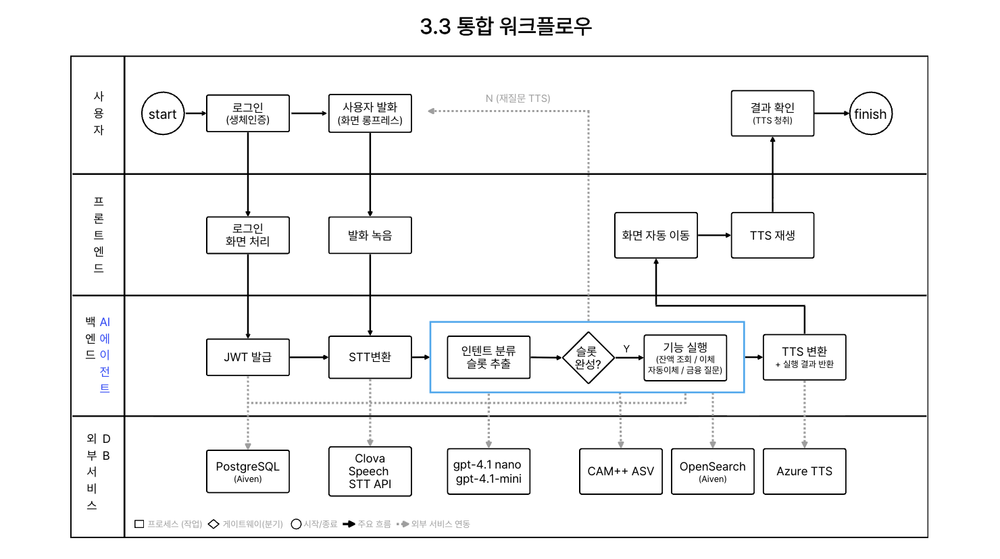
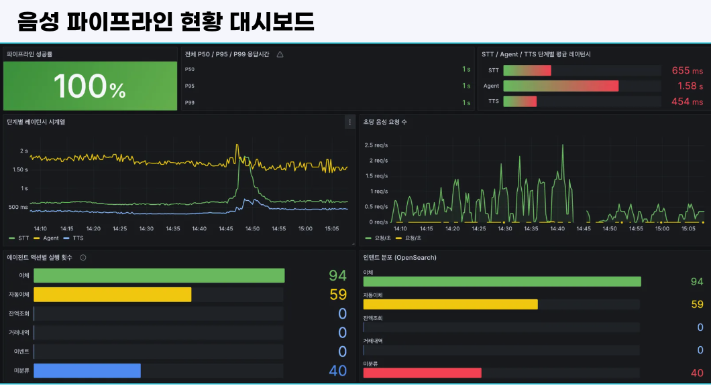
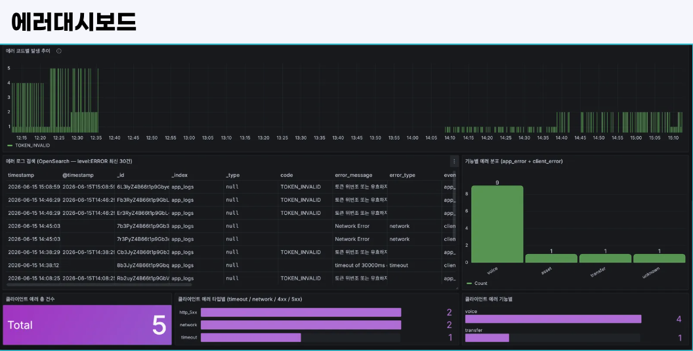
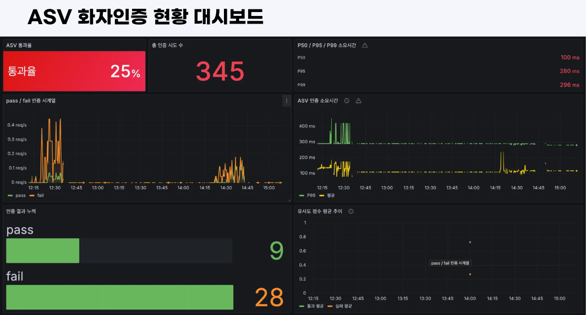

# [우리FISA 6기] AI 엔지니어링 과정 2팀 

## 1. 프로젝트 개요

- 주제 : 시각장애인을 위한 음성 AI 멀티 에이전트 기반 뱅킹 앱

- 프로젝트 기획 배경
: 시각장애인은 기존 모바일 뱅킹 앱의 복잡한 화면 구성, 작은 버튼, 보안매체 사ㄴ용 등으로 인해 송금이나 계좌 조회 같은 기본적인 금융 거래조차 큰 불편을 겪는다. 스크린리더만으로는 여러 단계로 이어지는 이체 흐름을 온전히 따라가기 어렵고, 특히 본인인증 단계에서는 타인의 도움이 필요한 경우가 잦아 금융 자립성과 보안이 동시에 제약된다. 본 프로젝트는 이러한 문제를 해결하기 위해, 음성만으로 뱅킹 앱의 핵심 기능을 수행할 수 있는 배리어프리 뱅킹 서비스를 구축하였다.

- 기술 스택

**앱 · AI · 백엔드**

    

**인프라 · 운영**

 ![AWS](https://img.shields.io/badge/AWS-FF9900?style=flat-square&logo=data:image/svg%2Bxml;base64,PHN2ZyByb2xlPSJpbWciIHZpZXdCb3g9IjAgMCAyNCAyNCIgeG1sbnM9Imh0dHA6Ly93d3cudzMub3JnLzIwMDAvc3ZnIj48dGl0bGU+QW1hem9uIEFXUzwvdGl0bGU+PHBhdGggZmlsbD0id2hpdGUiIGQ9Ik02Ljc2MyAxMC4wMzZjMCAuMjk2LjAzMi41MzUuMDg4LjcxLjA2NC4xNzYuMTQ0LjM2OC4yNTYuNTc2LjA0LjA2My4wNTYuMTI3LjA1Ni4xODMgMCAuMDgtLjA0OC4xNi0uMTUyLjI0bC0uNTAzLjMzNWEuMzgzLjM4MyAwIDAgMS0uMjA4LjA3MmMtLjA4IDAtLjE2LS4wNC0uMjM5LS4xMTJhMi40NyAyLjQ3IDAgMCAxLS4yODctLjM3NSA2LjE4IDYuMTggMCAwIDEtLjI0OC0uNDcxYy0uNjIyLjczNC0xLjQwNSAxLjEwMS0yLjM0NyAxLjEwMS0uNjcgMC0xLjIwNS0uMTkxLTEuNTk2LS41NzQtLjM5MS0uMzg0LS41OS0uODk0LS41OS0xLjUzMyAwLS42NzguMjM5LTEuMjMuNzI2LTEuNjQ0LjQ4Ny0uNDE1IDEuMTMzLS42MjMgMS45NTUtLjYyMy4yNzIgMCAuNTUxLjAyNC44NDYuMDY0LjI5Ni4wNC42LjEwNC45MTguMTc2di0uNTgzYzAtLjYwNy0uMTI3LTEuMDMtLjM3NS0xLjI3Ny0uMjU1LS4yNDgtLjY4Ni0uMzY3LTEuMy0uMzY3LS4yOCAwLS41NjguMDMxLS44NjMuMTAzLS4yOTUuMDcyLS41ODMuMTYtLjg2Mi4yNzJhMi4yODcgMi4yODcgMCAwIDEtLjI4LjEwNC40ODguNDg4IDAgMCAxLS4xMjcuMDIzYy0uMTEyIDAtLjE2OC0uMDgtLjE2OC0uMjQ3di0uMzkxYzAtLjEyOC4wMTYtLjIyNC4wNTYtLjI4YS41OTcuNTk3IDAgMCAxIC4yMjQtLjE2N2MuMjc5LS4xNDQuNjE0LS4yNjQgMS4wMDUtLjM2YTQuODQgNC44NCAwIDAgMSAxLjI0Ni0uMTUxYy45NSAwIDEuNjQ0LjIxNiAyLjA5MS42NDcuNDM5LjQzLjY2MiAxLjA4NS42NjIgMS45NjN2Mi41ODZ6bS0zLjI0IDEuMjE0Yy4yNjMgMCAuNTM0LS4wNDguODIyLS4xNDQuMjg3LS4wOTYuNTQzLS4yNzEuNzU4LS41MS4xMjgtLjE1Mi4yMjQtLjMyLjI3Mi0uNTEyLjA0Ny0uMTkxLjA4LS40MjMuMDgtLjY5NHYtLjMzNWE2LjY2IDYuNjYgMCAwIDAtLjczNS0uMTM2IDYuMDIgNi4wMiAwIDAgMC0uNzUtLjA0OGMtLjUzNSAwLS45MjYuMTA0LTEuMTkuMzItLjI2My4yMTUtLjM5LjUxOC0uMzkuOTE3IDAgLjM3NS4wOTUuNjU1LjI5NS44NDYuMTkxLjIuNDcuMjk2LjgzOC4yOTZ6bTYuNDEuODYyYy0uMTQ0IDAtLjI0LS4wMjQtLjMwNC0uMDgtLjA2NC0uMDQ4LS4xMi0uMTYtLjE2OC0uMzExTDcuNTg2IDUuNTVhMS4zOTggMS4zOTggMCAwIDEtLjA3Mi0uMzJjMC0uMTI4LjA2NC0uMi4xOTEtLjJoLjc4M2MuMTUxIDAgLjI1NS4wMjUuMzEuMDguMDY1LjA0OC4xMTMuMTYuMTYuMzEybDEuMzQyIDUuMjg0IDEuMjQ1LTUuMjg0Yy4wNC0uMTYuMDg4LS4yNjQuMTUxLS4zMTJhLjU0OS41NDkgMCAwIDEgLjMyLS4wOGguNjM4Yy4xNTIgMCAuMjU2LjAyNS4zMi4wOC4wNjMuMDQ4LjEyLjE2LjE1MS4zMTJsMS4yNjEgNS4zNDggMS4zODEtNS4zNDhjLjA0OC0uMTYuMTA0LS4yNjQuMTYtLjMxMmEuNTIuNTIgMCAwIDEgLjMxMS0uMDhoLjc0M2MuMTI3IDAgLjIuMDY1LjIuMiAwIC4wNC0uMDA5LjA4LS4wMTcuMTI4YTEuMTM3IDEuMTM3IDAgMCAxLS4wNTYuMmwtMS45MjMgNi4xN2MtLjA0OC4xNi0uMTA0LjI2My0uMTY4LjMxMWEuNTEuNTEgMCAwIDEtLjMwMy4wOGgtLjY4N2MtLjE1MSAwLS4yNTUtLjAyNC0uMzItLjA4LS4wNjMtLjA1Ni0uMTE5LS4xNi0uMTUtLjMybC0xLjIzOC01LjE0OC0xLjIzIDUuMTRjLS4wNC4xNi0uMDg3LjI2NC0uMTUuMzItLjA2NS4wNTYtLjE3Ny4wOC0uMzIuMDh6bTEwLjI1Ni4yMTVjLS40MTUgMC0uODMtLjA0OC0xLjIyOS0uMTQzLS4zOTktLjA5Ni0uNzEtLjItLjkxOC0uMzItLjEyOC0uMDcxLS4yMTUtLjE1MS0uMjQ3LS4yMjNhLjU2My41NjMgMCAwIDEtLjA0OC0uMjI0di0uNDA3YzAtLjE2Ny4wNjQtLjI0Ny4xODMtLjI0Ny4wNDggMCAuMDk2LjAwOC4xNDQuMDI0LjA0OC4wMTYuMTIuMDQ4LjIuMDguMjcxLjEyLjU2Ni4yMTUuODc4LjI3OS4zMTkuMDY0LjYzLjA5Ni45NS4wOTYuNTAyIDAgLjg5NC0uMDg4IDEuMTY1LS4yNjRhLjg2Ljg2IDAgMCAwIC40MTUtLjc1OC43NzcuNzc3IDAgMCAwLS4yMTUtLjU1OWMtLjE0NC0uMTUxLS40MTYtLjI4Ny0uODA3LS40MTVsLTEuMTU3LS4zNmMtLjU4My0uMTgzLTEuMDE0LS40NTQtMS4yNzctLjgxM2ExLjkwMiAxLjkwMiAwIDAgMS0uNC0xLjE1OGMwLS4zMzUuMDczLS42My4yMTYtLjg4Ni4xNDQtLjI1NS4zMzUtLjQ3OS41NzUtLjY1NC4yNC0uMTg0LjUxLS4zMi44My0uNDE1LjMyLS4wOTYuNjU1LS4xMzYgMS4wMDYtLjEzNi4xNzUgMCAuMzU5LjAwOC41MzUuMDMyLjE4My4wMjQuMzUuMDU2LjUxOC4wODguMTYuMDQuMzEyLjA4LjQ1NS4xMjcuMTQ0LjA0OC4yNTYuMDk2LjMzNi4xNDRhLjY5LjY5IDAgMCAxIC4yNC4yLjQzLjQzIDAgMCAxIC4wNzEuMjYzdi4zNzVjMCAuMTY4LS4wNjQuMjU2LS4xODQuMjU2YS44My44MyAwIDAgMS0uMzAzLS4wOTYgMy42NTIgMy42NTIgMCAwIDAtMS41MzItLjMxMWMtLjQ1NSAwLS44MTUuMDcxLTEuMDYyLjIyMy0uMjQ4LjE1Mi0uMzc1LjM4My0uMzc1LjcxIDAgLjIyNC4wOC40MTYuMjQuNTY3LjE1OS4xNTIuNDU0LjMwNC44NzcuNDRsMS4xMzQuMzU4Yy41NzQuMTg0Ljk5LjQ0IDEuMjM3Ljc2Ny4yNDcuMzI3LjM2Ny43MDIuMzY3IDEuMTE3IDAgLjM0My0uMDcyLjY1NS0uMjA3LjkyNi0uMTQ0LjI3Mi0uMzM2LjUxMS0uNTgzLjcwMy0uMjQ4LjItLjU0My4zNDMtLjg4Ni40NDctLjM2LjExMS0uNzM0LjE2Ny0xLjE0Mi4xNjd6TTIxLjY5OCAxNi4yMDdjLTIuNjI2IDEuOTQtNi40NDIgMi45NjktOS43MjIgMi45NjktNC41OTggMC04Ljc0LTEuNy0xMS44Ny00LjUyNi0uMjQ3LS4yMjMtLjAyNC0uNTI3LjI3Mi0uMzUxIDMuMzg0IDEuOTYzIDcuNTU5IDMuMTUzIDExLjg3NyAzLjE1MyAyLjkxNCAwIDYuMTE0LS42MDcgOS4wNi0xLjg1Mi40MzktLjIuODE0LjI4Ny4zODMuNjA3ek0yMi43OTIgMTQuOTYxYy0uMzM2LS40My0yLjIyLS4yMDctMy4wNzQtLjEwMy0uMjU1LjAzMi0uMjk1LS4xOTItLjA2My0uMzYgMS41LTEuMDUzIDMuOTY3LS43NSA0LjI1NC0uMzk5LjI4Ny4zNi0uMDggMi44MjYtMS40ODUgNC4wMDctLjIxNS4xODQtLjQyMy4wODgtLjMyNy0uMTUxLjMyLS43OSAxLjAzLTIuNTcuNjk1LTIuOTk0eiIvPjwvc3ZnPg==)  

**기획 · 디자인**

 


## 2. 아키텍처

### 2.1 시스템 아키텍처


**설명**

**CI/CD 및 배포**  
GitHub Actions 기반 CI/CD 파이프라인을 통해 코드 변경 시 자동으로 빌드 및 배포가 이루어집니다. Backend(FastAPI)는 Docker 컨테이너로 AWS에 배포됩니다.

**데이터 및 보안**  
PostgreSQL, S3, OpenSearch와 연동하여 금융 데이터 저장 및 검색 기능을 수행합니다. 송금 등 민감 거래 시에는 ASV(화자인증)를 통해 본인 확인을 수행합니다.

**모니터링 및 운영**  
Prometheus, Grafana, Fluent Bit 을 활용한 모니터링 및 로그 관리 환경을 통해 시스템의 안정적인 운영을 지원합니다.

## 3. 주요 기능 소개

### 3.1 핵심 기술 구성



### 3.2 AI 에이전트 워크플로우



**설명**

**음성 AI 파이프라인**  
Clova STT·GPT·Azure TTS와 연동하여 음성 입력, AI 처리, 음성 응답까지의 흐름을 구성합니다. LangGraph Supervisor가 transfer·asset·RAG 하위 에이전트로 업무를 분기하는 멀티 에이전트 구조를 적용하였습니다.

### 3.3 통합 워크플로우 다이어그램



### 3.4 모니터링


|             |       |
| ----------- | ----- |
|  |  |


  


### 3.5 세부 기능 소개

---

#### [기능 1] AES-256-GCM 컬럼 단위 암호화

- **파일:** `backend/app/shared/crypto.py`
- **설명:** 주민번호·계좌번호를 DB에 저장할 때 컬럼 단위로 암호화. nonce를 매번 새로 생성해 동일 평문도 다른 암호문이 나오는 비결정적 암호화 설계. 복호화는 반드시 이 모듈의 `decrypt()`를 통해서만 수행하도록 단일 책임 원칙 적용

**핵심 코드**

```python
def encrypt(plaintext: str | None) -> str | None:
    aesgcm = AESGCM(_key())
    nonce = os.urandom(_NONCE_BYTES)          # 12바이트 랜덤 nonce (매번 새로 생성)
    ciphertext = aesgcm.encrypt(nonce, plaintext.encode(), None)
    return base64.urlsafe_b64encode(nonce + ciphertext).decode()
    # 출력: base64url(nonce_12B + ciphertext + auth_tag_16B)
```

---

#### [기능 2] LangGraph Supervisor 우선순위 기반 도메인 라우팅

- **파일:** `backend/app/shared/agent/supervisor.py`
- **설명:** 단순 LLM 분류가 아니라 키워드 패스트패스 → 세션 유지 → 도메인 전환 감지 → LLM 폴백 순의 6단계 우선순위 체계로 응답 속도와 정확도를 동시에 확보. gpt-4o-nano는 최후 수단으로만 호출

**핵심 코드**

```python
async def _decide_domain(text: str, state: VoiceState) -> str:
    if _is_navigation_utterance(text):
        return "cancel"                              # 1순위: 홈 이동 키워드 (세션 무관)
    if _is_cancel_utterance(text) and _has_active_session(state):
        return "cancel"                              # 2순위: 취소 + 활성 세션
    if _has_active_session(state):
        return "transfer"                            # 3순위: 이체 세션 유지
    if state.get("agent_domain") == "asset" and not _is_domain_switch_utterance(text):
        return "asset"                               # 4순위: asset 연속 세션 유지
    if is_plain_transfer_start(text):
        return "transfer"                            # 5순위: 이체 키워드 패스트패스
    if "이벤트" in _normalize(text):
        return "event"                               # 5순위: 이벤트 키워드
    return await _llm_classify_domain(text)          # 6순위: gpt-4o-mini LLM 폴백
```

---

#### [기능 3] CAM++ ASV 화자 인증 (192차원 임베딩 + 코사인 유사도)

- **파일:** `ai/asv/model.py`
- **설명:** 이체 실행 전 본인 목소리를 실시간 검증. 오디오를 16kHz 모노로 정규화 후 CAM++ 모델로 192차원 임베딩 추출. 코사인 유사도가 환경변수 `ASV_THRESHOLD` 이상이면 동일 화자로 판정. 어떤 상태도 영속하지 않는 Stateless 설계

**핵심 코드**

```python
def extract_embedding(self, audio_bytes: bytes) -> list[float]:
    # soundfile 디코딩 → 스테레오→모노 → 16kHz 리샘플링 → 임시 파일 기록
    result = self._pipeline([tmp_path], output_emb=True)
    return np.array(result["embs"]).flatten().tolist()  # 192차원 벡터 반환

@staticmethod
def cosine_similarity(embedding1: list[float], embedding2: list[float]) -> float:
    a = np.array(embedding1, dtype=np.float32)
    b = np.array(embedding2, dtype=np.float32)
    if np.linalg.norm(a) == 0.0 or np.linalg.norm(b) == 0.0:
        return 0.0
    return float(np.dot(a, b) / (np.linalg.norm(a) * np.linalg.norm(b)))
    # >= ASV_THRESHOLD → is_same_speaker=True
```

---

#### [기능 4] STT 오디오 입력 검증 파이프라인

- **파일:** `backend/app/shared/voice/stt_service.py`
- **설명:** Clova Speech API 호출 전에 파일 크기(10MB), 포맷(10종 MIME), 길이(60초)를 3단 검증해 불필요한 외부 API 비용 차단. 길이 검증은 mutagen으로 실제 오디오 메타데이터를 파싱해 수행

**핵심 코드**

```python
def _validate_audio(audio_bytes: bytes, content_type: str) -> None:
    if len(audio_bytes) > MAX_AUDIO_BYTES:                    # 10 MB 초과
        raise STTError(code="VOICE_AUDIO_TOO_LARGE", ...)
    mime = content_type.split(";")[0].strip().lower()
    if mime not in SUPPORTED_CONTENT_TYPES:                   # 포맷 미지원
        raise STTError(code="VOICE_AUDIO_INVALID_FORMAT", ...)
    duration = _get_audio_duration(audio_bytes)               # mutagen 메타데이터 파싱
    if duration is not None and duration > MAX_AUDIO_DURATION:# 60초 초과
        raise STTError(code="VOICE_AUDIO_TOO_LONG", ...)
```

---

#### [기능 5] Azure TTS SSML 속도 제어

- **파일:** `backend/app/shared/voice/tts_service.py`
- **설명:** 시각장애인 대상 앱이므로 TTS 속도 조절이 핵심 UX. float 속도값을 SSML prosody rate 포맷(+50%, -20%)으로 변환해 Azure TTS에 전달. 속도 범위 0.25~4.0 검증 포함

**핵심 코드**

```python
def _build_ssml(text: str, voice_name: str, speed: float) -> str:
    rate = _speed_to_rate(speed)   # 1.5 → "+50%", 0.8 → "-20%"
    return (
        "<speak version='1.0' xml:lang='ko-KR'>"
        f"<voice name='{voice_name}'>"
        f"<prosody rate='{rate}'>{text}</prosody>"
        "</voice></speak>"
    )

def _speed_to_rate(speed: float) -> str:
    percentage = round((speed - 1.0) * 100)
    return f"+{percentage}%" if percentage >= 0 else f"{percentage}%"
```

---

#### [기능 6] 이체 멱등성 3중 보호

- **파일:** `backend/app/features/transfer/service.py`
- **설명:** 네트워크 재시도·앱 재실행 등으로 동일 이체가 중복 실행되는 것을 3단계로 차단. 앱 레벨 키 중복 조회 → DB UNIQUE 제약으로 동시 INSERT 차단 → SELECT FOR UPDATE 비관적 락으로 잔액 이중 차감 방지. 이미 완료된 요청은 DB 조회 없이 기존 영수증을 재반환

**핵심 코드**

```python
# 1단계: 앱 레벨 — 키 중복 조회
existing = db.query(Transaction).filter(
    Transaction.idempotency_key == idempotency_key
).first()
if existing and existing.status == "completed":
    return _build_receipt(existing)   # 출금 없이 기존 영수증 재반환

# 2단계: DB 레벨 — pending INSERT 후 UNIQUE 위반 즉시 감지 (동시 요청 최후 방어선)
tx = Transaction(..., status="pending", idempotency_key=idempotency_key)
db.add(tx)
db.flush()   # IntegrityError → 409 반환

# 3단계: 비관적 락 — 잔액 이중 차감 방지
locked = db.query(Account).filter(
    Account.account_id == from_account.account_id
).with_for_update().first()
locked.balance -= amount
tx.status = "completed"
db.commit()
```

---

#### [기능 7] VoiceState 멀티턴 슬롯 수집 상태 머신

- **파일:** `backend/app/shared/agent/state.py`
- **설명:** 음성 이체는 수취인·금액·주기 등 여러 정보를 여러 턴에 걸쳐 수집해야 한다. LangGraph MemorySaver에 thread_id=user_id로 상태를 영속해, 새 턴마다 대화 이력만 추가하면 나머지 슬롯·확인 상태가 자동으로 이어짐. ASV 검증 단계도 동일한 상태 객체로 제어

**핵심 코드**

```python
class VoiceState(TypedDict):
    messages: Annotated[list, add_messages]   # 대화 이력 자동 누적 (add_messages 리듀서)
    pending_action: str | None                # "transfer" | "auto_transfer"
    collected_slots: dict                     # {"recipient": "엄마", "amount": 100000}
    awaiting_confirmation: bool               # "네/아니오" 확인 대기
    awaiting_asv_audio: bool                  # 다음 오디오 → ASV EC2 서버 라우팅
    asv_retry_count: int                      # 실패 3회 초과 시 pending_action 취소
    execution_ready: bool                     # 확인 완료 → execute_node 즉시 실행
    last_tx_id: str | None                    # 이체 직후 메모 제안용 tx_id 보관
    awaiting_memo_decision: bool              # 이체 후 메모 제안 응답 대기
```