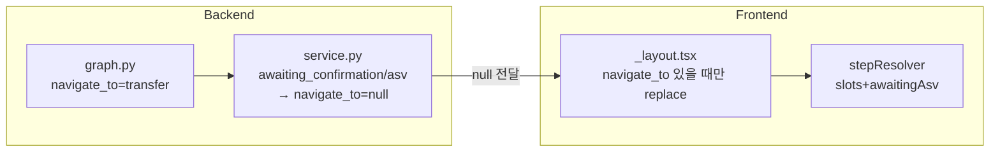

# TTS-화면 동기화 수정 계획

## 목표 UX (사용자 확인 기준)

| 발화/단계 | 슬롯 상태 | 기대 화면 (`/transfer` 내부 step) |
|-----------|-----------|-----------------------------------|
| 「이체하기」 | recipient·amount 없음 | `input-alias` (수취인) |
| 전화번호 → clarification → 「네」 | recipient만 있음 | `input-amount` (금액) |
| 「바보에게 3000원…」→ confirm TTS | recipient+amount, 확인 대기 | `confirm` |
| 「네」→ ASV TTS | awaiting_asv | `asv-pending` |
| 「홈」/취소/ASV 3회 실패 | 상태 초기화 | `/home` |

1·2번은 **정상 모델**로 유지. **3번(홈)**, **4번(confirm 이후 단계)** 이 깨져 있음.

---

## 근본 원인

1. **[`backend/app/shared/voice/service.py`](backend/app/shared/voice/service.py) L184-189** — `awaiting_confirmation` / `awaiting_asv_audio`일 때 `navigate_to`를 **강제로 null**. confirm·ASV TTS는 나오지만 화면 이동 없음 → **4번 직접 원인**.
2. **[`backend/app/shared/agent/graph.py`](backend/app/shared/agent/graph.py) L493-510** — `user_cancelled` 시 `navigate_to: None` → 취소/홈 발화 후 **transfer 화면에 머무름** → **3번 원인**.
3. **clarification / ASV 분기** — `awaiting_transfer_clarification`·`awaiting_asv_audio` 턴은 intent LLM을 거치지 않아 「홈」 키워드가 **home intent로 처리되지 않음**.
4. **프론트 상태** — 홈 이동 시 [`transferStore`](frontend/store/transferStore.ts)만 reset, [`voiceResponseStore`](frontend/store/voiceResponseStore.ts)는 유지 → 송금 재진입 시 슬롯 잔존(부수 증상).

---

## 수정 방향

### A. Backend: `navigate_to` 항상 전달 (핵심)

**파일:** [`backend/app/shared/voice/service.py`](backend/app/shared/voice/service.py)

- L184-189 **삭제** — graph가 준 `navigate_to`를 그대로 응답에 실음.
- `_resolve_navigate_to(result: dict) -> str | None` 헬퍼 추가 (graph가 null이어도 슬롯 기준 fallback):
  - `pending_action == "transfer"` + slots 비어 있음 → `"transfer"`
  - recipient만 있음 → `"transfer"` (amount step)
  - recipient+amount + `awaiting_confirmation` → `"transfer"` (confirm step)
  - `awaiting_asv_audio` + transfer pending → `"transfer"` (asv step)
  - `pending_action` in `SCREEN_MAP` → 해당 경로
- `_handle_normal_flow` return 직전에 `navigate_to = _resolve_navigate_to(result)` 적용.
- ASV 3회 실패·memo skip 등 `navigate_to: home` 응답도 그대로 유지.

### B. Backend: graph 노드별 `navigate_to` 명시

**파일:** [`backend/app/shared/agent/graph.py`](backend/app/shared/agent/graph.py)

| 위치 | 변경 |
|------|------|
| `user_cancelled` (L493) | `navigate_to: "home"` + 상태 필드 전체 초기화 (home intent 블록과 동일) |
| `awaiting_confirmation` + ASV 필요 (L518) | `navigate_to: SCREEN_MAP.get(action)` 추가 |
| `confirm_node` (L651) | `navigate_to: SCREEN_MAP.get(pending)` 추가 |
| `intent == "home"` (L545) | 기존 유지 (이미 home 설정) |

**파일:** [`backend/app/shared/agent/transfer_clarification.py`](backend/app/shared/agent/transfer_clarification.py)

- `build_transfer_clarification_response` 상단에 홈/취소 키워드 분기 추가 (`is_clarification_no` 또는 home 키워드) → `navigate_to: "home"`, 상태 초기화.

**파일:** [`backend/app/shared/voice/service.py`](backend/app/shared/voice/service.py) — `_handle_asv_flow`

- STT transcript(또는 별도 키워드)에 「홈」「취소」 감지 시 ASV verify 생략, `reset_voice_state` + `navigate_to: home` TTS 반환 (ASV 대기 중 홈 탈출).

### C. Backend: 홈 이동 시 LangGraph 초기화 API

**파일:** [`backend/app/shared/voice/router.py`](backend/app/shared/voice/router.py), [`service.py`](backend/app/shared/voice/service.py)

- `reset_voice_state`를 **전체 필드**와 맞게 확장 (`awaiting_memo_decision`, `draft_recipient`, `last_tx_id` 등 [`graph.py` home 블록](backend/app/shared/agent/graph.py)과 동일).
- `POST /api/voice/reset-state` (JWT) 추가 — 프론트가 홈/취소 navigate 직후 호출.

### D. Frontend: navigate + step 동기화

**파일:** [`frontend/app/_layout.tsx`](frontend/app/_layout.tsx)

- `navigateFromAgent`에서 `navigateTo === 'home'` 시:
  - `transferStore.reset()` (기존)
  - `voiceResponseStore` 초기화 (`setLastResponse` with empty slots or dedicated `clear()`)
  - `POST /api/voice/reset-state` fire-and-forget (선택, 실패해도 UI는 reset)
- `navigate_to === 'transfer'`일 때도 `router.replace('/transfer')` 호출 — **이미 transfer에 있어도** `lastResponse` 갱신으로 step 재계산 (confirm/asv 반영).

**파일:** [`frontend/app/transfer/stepResolver.ts`](frontend/app/transfer/stepResolver.ts)

- `resolveTransferStep(slots, awaitingAsv, awaitingConfirmation?)` 시그니처 확장:
  - `awaitingAsv` → `asv-pending`
  - `awaitingConfirmation && recipient && amount` → `confirm` (명시)
  - 그 외 기존 recipient/amount 분기 유지

**파일:** [`frontend/app/transfer/index.tsx`](frontend/app/transfer/index.tsx)

- `resolveTransferStep`에 `lastResponse?.awaiting_confirmation` 전달.
- slots 비었을 때 `transferStore`도 clear (`setSelectedRecipient(null)`, `setAmount(null)`) — 홈 복귀·취소 후 재진입 잔존 방지.

---

## 검증 시나리오 (수동)

1. 홈에서 「이체하기」→ TTS 「누구에게」+ `/transfer` 수취인 step
2. 「010-1111-0003」→ clarification → 「네」→ TTS 「얼마를」+ `/transfer` 금액 step
3. transfer/confirm/ASV 중 「홈으로」→ TTS + `/home` + 슬롯 없음
4. 「바보에게 3000원 이체하고 싶어」→ confirm TTS + `/transfer` confirm step
5. confirm 「네」→ ASV TTS + `/transfer` asv step
6. ASV 3회 실패 → home TTS + `/home` + 상태 초기화

---

## 테스트

**파일:** [`backend/tests/test_voice_pipeline.py`](backend/tests/test_voice_pipeline.py)

- confirm + `awaiting_confirmation=True` mock → `navigate_to == "transfer"` (null 아님)
- ASV 대기 mock → `navigate_to == "transfer"`

**파일:** [`backend/tests/test_agent_multiturn.py`](backend/tests/test_agent_multiturn.py) 또는 [`test_transfer_clarification.py`](backend/tests/test_transfer_clarification.py)

- `user_cancelled` → `navigate_to == "home"`
- clarification 중 home 키워드 → home navigate

**파일:** `frontend/app/transfer/stepResolver` — `awaitingConfirmation` true 시 `confirm` 반환 단위 테스트 (선택)

---

## 커밋 제안 (구현 후)

1. `fix(voice): confirm·ASV 구간 navigate_to 억제 제거`
2. `fix(agent): 취소·clarification·ASV 홈 탈출 시 home navigate`
3. `fix(frontend): transfer stepResolver·홈 이동 시 store 초기화`

PR 본문: `Closes #N` + 위 4개 검증 시나리오 체크리스트.
