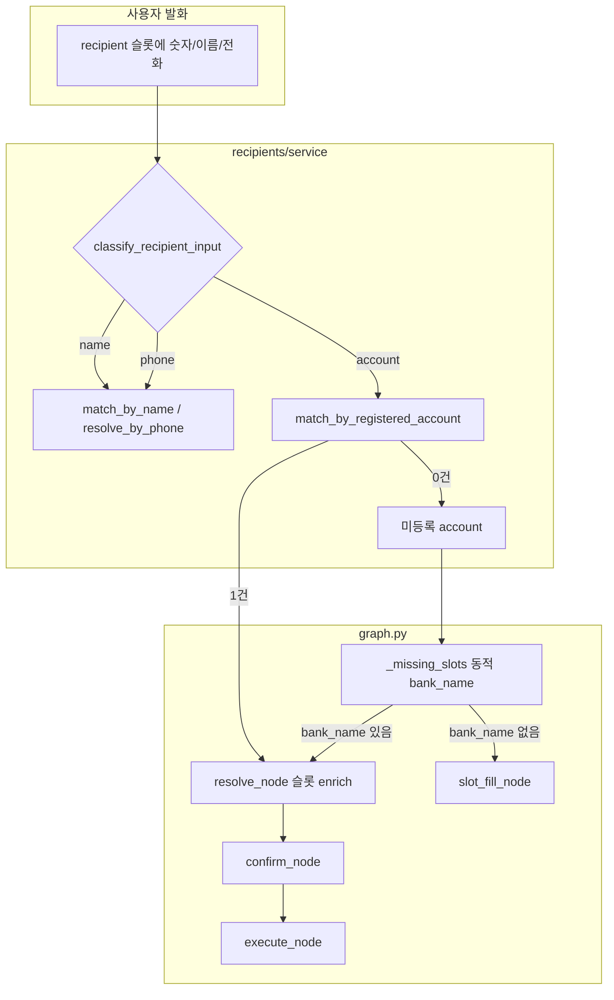

# 계좌번호 음성 이체 지원 계획 (슬롯 통합版)

## 설계 원칙

- **경로별 슬롯 분리 없음**: [`SLOT_SCHEMA`](backend/app/shared/agent/slot_schema.py)의 `transfer`는 계속 `["recipient", "amount"]`만 문서화.
- **판단은 값으로**: [`classify_recipient_input`](backend/app/features/recipients/service.py) (`name` | `phone` | `account`) + `collected_slots` 내용.
- **`bank_name`만 조건부 추가**: `recipient`가 `account`이고 **등록 수취인 매칭 실패**일 때만 `_missing_slots` / `slot_fill` 대상.
- **등록 계좌 우선**: 앱에 등록된 계좌번호면 [`registered_recipients`](backend/app/models/recipient.py)에서 `bank_name`, `recipient_name`, `recipient_id` 자동 확보 (주석 259–260의 “미지원”은 **미등록 직접 이체**만 해당).



---

## Phase 1 — Recipients: 계좌 조회·lookup 확장

**파일**: [`backend/app/features/recipients/service.py`](backend/app/features/recipients/service.py)

| 작업 | 설명 |
|------|------|
| `normalize_account_digits(value)` | `-`, 공백 제거 후 10–14자리 검증 (이체 API [`execute_transfer`](backend/app/features/transfer/service.py)와 동일 규칙) |
| `match_by_registered_account(db, user_uuid, digits)` | 해당 사용자 `registered_recipients` 목록 조회 → `decrypt(account_number)` 후 digits 비교. **0건** `None`, **1건** `RegisteredRecipient`, **2건+** `None` + 로그(별명 재질문 유도) |
| `resolve_by_registered_account(...)` | 1건 매칭 시 기존 [`ResolvedRecipient`](backend/app/features/recipients/schema.py) 반환 (`recipient_id`, `bank_name`, `account_number`, `recipient_name`) |
| `lookup_recipient_by_voice` 수정 | `kind == "account"`: 등록 계좌 매칭 시 `resolve_by_registered_account` 결과 반환. **0건**이면 `None` (은행명은 아직 없음 — graph가 `bank_name` 수집) |
| 주석 정리 | 259–260: “미등록 계좌는 `bank_name` 필요 / 등록 계좌는 DB에서 은행명·이름 조회” |

**암호화**: GCM이라 DB equality 불가 → 사용자별 등록 수취인 수가 적다는 전제하에 **복호화 비교** (기존 [`match_by_name`](backend/app/features/recipients/service.py) 패턴과 동일 트레이드오프).

**테스트**: [`backend/tests/test_recipients.py`](backend/tests/test_recipients.py)에 `match_by_registered_account` / lookup account 경로 추가 (`CRYPTO_NOOP` 픽스처 활용).

---

## Phase 2 — Agent: 동적 누락 슬롯·resolve enrich·execute

### 2a. `_missing_slots` / `SLOT_QUESTIONS`

**파일**: [`backend/app/shared/agent/graph.py`](backend/app/shared/agent/graph.py), [`backend/app/shared/agent/slot_schema.py`](backend/app/shared/agent/slot_schema.py)

- `graph._missing_slots`를 확장 (또는 `slot_schema.transfer_missing_slots(slots)` 헬퍼):
  - 기본: `recipient`, `amount`
  - `classify(slots["recipient"]) == "account"` **이고** `bank_name` 없음 **이고** 등록 매칭으로 `recipient_id` 없음 → `bank_name` 누락
- `SLOT_QUESTIONS["bank_name"]` 추가: `"어느 은행 계좌인가요? 우리은행, 국민은행처럼 말씀해 주세요."`

### 2b. `resolve_node` — 이름만 반환하지 않기

**현재 문제**: [`find_recipient_by_voice`](backend/app/features/recipients/service.py) → 실명 문자열만 → [`resolve_node`](backend/app/shared/agent/graph.py)가 `slots["recipient"]`만 덮어씀 → 계좌·은행·`recipient_id` 소실.

**변경**:

- `find_recipient_by_voice` → `ResolvedRecipient | None` 반환 (또는 parallel `lookup_recipient_full`).
- 성공 시 `collected_slots` **enrich** (경로 메타 필드 아님, **resolve 결과**):
  - `recipient`: 안내용 (`alias` 우선 또는 `recipient_name`)
  - `bank_name`: DB/전화 조회 결과
  - `recipient_id`: 등록 수취인일 때만 (문자열)
- `account` + 등록 **미매칭** + `bank_name` 없음: `recipient`는 digits 유지, `recipient_validated=False`, TTS로 은행 질문 유도 (slot_fill로 연결).
- `account` + `bank_name` 있음(미등록): 형식 검증 후 `recipient_validated=True`, `recipient`는 수취인명 없으면 마스킹된 안내용 유지.

### 2c. `confirm_node` TTS

**파일**: `graph._format_confirm_message`

- `bank_name` 있으면 `"우리은행 계좌 끝네 자리 …"` 형태 ( [`transfer/service._mask_account`](backend/app/features/transfer/service.py) 재사용 또는 동일 로직 복제).
- 평문 계좌 전체를 TTS에 읽지 않음 ([`prompts.py`](backend/app/shared/agent/prompts.py) 보안 규칙과 정합).

### 2d. `run_execute_transfer`

**파일**: [`backend/app/shared/agent/tools/transfer.py`](backend/app/shared/agent/tools/transfer.py)

슬롯 기반 분기 (이름으로 재-lookup 하지 않음):

1. `recipient_id` in slots → `resolve_by_id` → `execute_transfer`
2. `bank_name` + account digits in slots (`classify(recipient)` 또는 별도 `account_digits` enrich 필드) → 직접 `execute_transfer(recipient=digits, bank_name=..., recipient_id=None)`
3. 그 외 → 기존 `lookup_recipient_by_voice(recipient)` (name/phone)

### 2e. `transfer_clarification` 연동

**파일**: [`backend/app/shared/agent/transfer_clarification.py`](backend/app/shared/agent/transfer_clarification.py)

- 송금 확인 「네」 후 `draft_recipient`를 `collected_slots.recipient`에 넣고 `resolve_node`로 라우팅 (이미 `transfer` pending이면 route에서 resolve 진입).
- 계좌만 있는 draft → 등록 매칭 시도 → 성공 시 `bank_name` 질문 생략.

### 2f. LLM 프롬프트 (보조)

**파일**: [`backend/app/shared/agent/graph.py`](backend/app/shared/agent/graph.py) intent_node 규칙

- `extracted_slots`에 `bank_name` 추출 예시 (`우리은행 110…`).
- 계좌번호는 `recipient`에 넣어도 됨 (기존 예시 유지).

**범위 외 (1차)**: `auto_transfer` 동일 패턴 — transfer 검증 후 복제.

---

## Phase 3 — Frontend (최소)

**파일**: [`frontend/app/transfer/index.tsx`](frontend/app/transfer/index.tsx)

현재 [`recipientFromSlots`](frontend/app/transfer/index.tsx)는 `toBankName: ''` 고정:

```21:24:frontend/app/transfer/index.tsx
  return { recipientId: null, toName: name, toBankName: '', accountMasked: '' };
```

- `slots.bank_name` (또는 `bankName`) → `toBankName` 매핑
- `slots.recipient_id` → `recipientId` 매핑 (터치 `executeTransfer` 경로 대비)
- [`stepResolver.ts`](frontend/app/transfer/stepResolver.ts): **변경 없음** (`recipient` / `amount`만으로 단계 판단 유지)

[`ConfirmStepView`](frontend/app/transfer/views/ConfirmStepView.tsx)는 이미 `bankName` 표시 지원.

---

## Phase 4 — 테스트·문서

| 항목 | 내용 |
|------|------|
| 단위 | `test_recipients.py` (등록 계좌 매칭), `test_transfer_clarification.py` (계좌만 → 확인 → 네 → resolve), `test_transfer_tools.py` (slots에 `recipient_id` / `bank_name` 직접 execute) |
| 통합 | [`test_agent_multiturn.py`](backend/tests/test_agent_multiturn.py) mock LLM으로 account + bank 시나리오 |
| 문서 | [`voice-pipeline-flow.md`](voice-pipeline-flow.md) 표 175행 `account` 행 갱신, [`to-do.md`](to-do.md) 후속 `[ ] 계좌번호 직접 이체` 체크 |

---

## 시나리오 검증 체크리스트

| 발화 | 기대 |
|------|------|
| 등록된 계좌번호만 | 송금 확인 → 네 → `bank_name` 질문 **없음** → amount → confirm (이름·은행 표시) |
| 미등록 계좌번호만 | 송금 확인 → 네 → 「어느 은행…」 → amount → confirm |
| `우리은행` + 계좌 + `3만원` + 이체 | `transfer`, resolve/enrich, amount, confirm 한 번에 |
| `010 1111 0003` | 기존 clarification (전화 경로, 변경 최소) |

---

## 커밋 제안 (구현 시)

1. `feat(recipients): match_by_registered_account 및 account lookup`
2. `feat(agent): 동적 bank_name·resolve enrich·execute 슬롯 분기`
3. `feat(transfer-ui): collected_slots bank_name 매핑` + 문서/테스트

**기준 브랜치**: `feature/transfer-06-02`, 최근 fix `3ee2bda` (clarification + TTS) 위에 쌓기.
